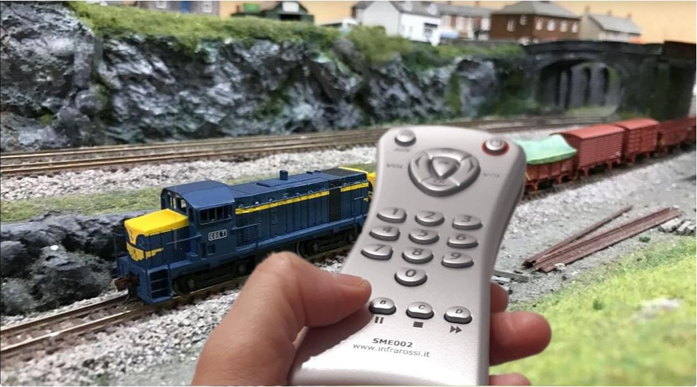
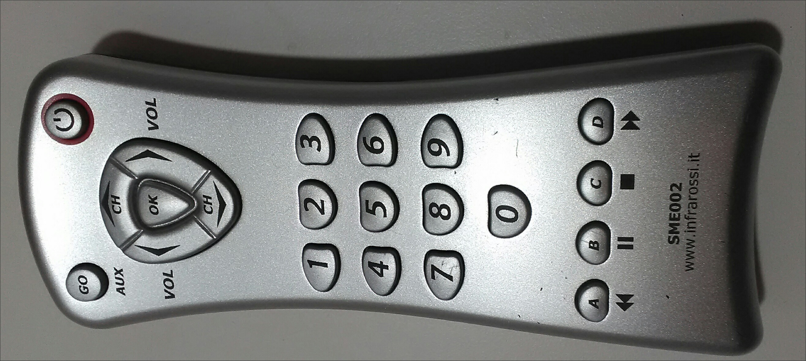
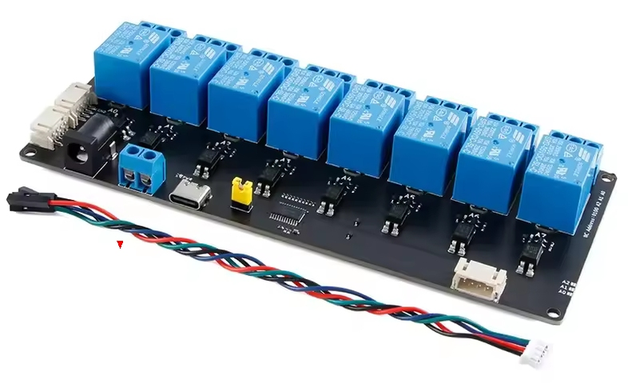
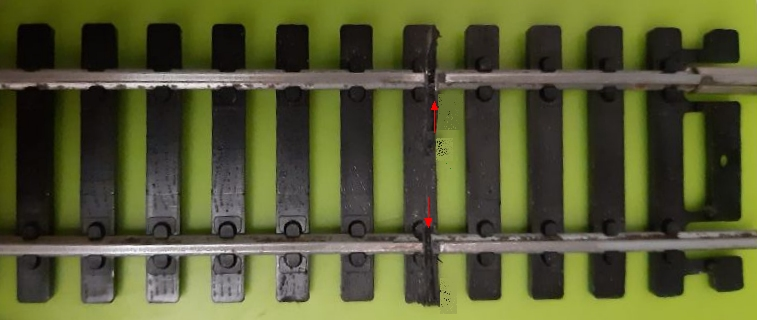
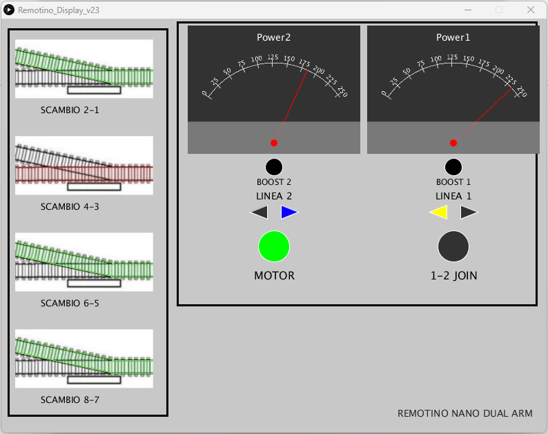
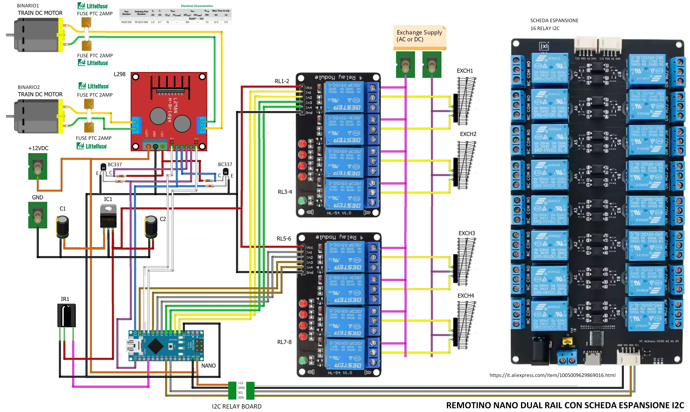
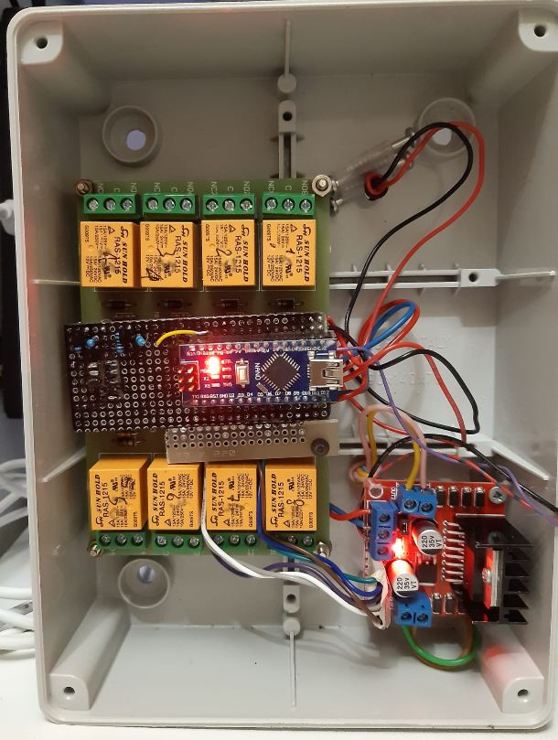

# Remotino Nano Dual Rail

**Remotino Nano Dual Rail** è l'evoluzione naturale di **Remotino Nano**: un sistema completo per il controllo di un plastico ferroviario in scala H0, basato su **Arduino Nano**, telecomando a infrarossi e controllo PWM dei due binari.

L'obiettivo del progetto è ottenere un controllo semplice ma preciso dei treni analogici, mantenendo allo stesso tempo la possibilità di gestire scambi, luci e altre utenze del plastico.

---

## 1. Caratteristiche principali

### 1.1 Controllo dei treni

- Controllo di un plastico con **trenini analogici** (tipo LIMA) tramite telecomando a infrarossi.

- **Due binari indipendenti**, controllati in PWM sia per la velocità sia per la direzione.
- Il controllo PWM consente velocità molto basse, realmente in scala 1:87, con **partenze e fermate lente e graduali**, più simili al comportamento di un treno reale.

https://github.com/user-attachments/assets/d638dfb1-e052-454d-9ad7-9dd413f32621

### 1.2 Gestione di scambi e utenze

- Controllo di **8 relè** per l'attivazione di:
  - scambi;
  - luci;
  - alimentazione di tronchini morti;
  - altre utenze del plastico.
- Se i relè vengono utilizzati per gli scambi in modalità monostabile, sono necessari **2 relè per ogni scambio**.
- Il sistema è espandibile verso schede da **8 o 16 relè con protocollo I²C**.

### 1.3 Funzioni speciali

- Possibilità di unire temporaneamente i due circuiti per permettere il passaggio di un treno da un binario all'altro tramite la funzione **JOIN**.
- Funzione **BOOST** per aiutare la partenza di un treno quando viaggia a velocità molto bassa, in salita o con un carico elevato.
- Protezione dei circuiti tramite **quattro fusibili PTC autoripristinanti**.

---

## 2. Architettura del sistema

Il progetto è organizzato attorno ad Arduino Nano, che gestisce:

- i due circuiti di alimentazione dei binari;
- la regolazione PWM della velocità;
- il comando della direzione;
- la funzione JOIN;
- gli 8 relè;
- la ricezione dei comandi dal telecomando;
- la comunicazione seriale con il PC.

Per la realizzazione pratica vengono utilizzati, dove possibile, **moduli e schede commerciali**. Lo schema generale riportato più avanti è quindi utile per comprendere l'architettura, mentre per una replica completa del progetto bisogna fare riferimento allo **schema reale KiCad** contenuto nella cartella `kicad`.

---

## 3. Configurazione degli 8 relè

Gli 8 relè possono essere configurati in **quattro modalità**, in funzione dell'utilizzo previsto sul plastico.

| Modalità | Configurazione |
|----------|----------------|
| **MODO_A** | 8 relè monostabili per 4 scambi. Il tasto 1 chiude il relè 1 finché resta premuto. |
| **MODO_B** | 8 relè bistabili ON/OFF per 8 attivazioni. Il tasto 1 inverte lo stato del relè 1 a ogni pressione. |
| **MODO_C** | 6 relè monostabili per 3 scambi + 2 relè bistabili ON/OFF per 2 attivazioni. |
| **MODO_D** | 4 relè monostabili per 2 scambi + 4 relè bistabili ON/OFF per 2 attivazioni. |

### Memorizzazione della modalità

La modalità viene selezionata **subito dopo il reset** premendo il relativo tasto:

- `A` → MODO_A
- `B` → MODO_B
- `C` → MODO_C
- `D` → MODO_D

La configurazione scelta viene quindi **memorizzata nella EEPROM** e mantenuta anche dopo lo spegnimento.

---

## 4. Cambio binario — funzione JOIN

La funzione **JOIN** permette di far passare un treno dal binario 1 al binario 2 evitando il collegamento diretto fra due circuiti che possono trovarsi a tensioni differenti.

### 4.1 Preparazione del collegamento

Per consentire fisicamente il passaggio del treno, i due circuiti devono essere collegati da un tratto di binario che presenti una **interruzione su entrambe le rotaie**.

Nel prototipo questa interruzione è stata realizzata con un seghetto da ferro.

Non è necessario unire elettricamente i due circuiti: è proprio la funzione JOIN a gestire temporaneamente le loro tensioni.

### 4.2 Funzionamento

Premendo il **tasto 9**:

1. le tensioni dei due circuiti vengono portate a zero;
2. viene attivata la modalità JOIN;
3. lo stesso comando viene applicato a entrambi i circuiti;
4. il treno può attraversare il tratto di collegamento passando da un binario all'altro;
5. terminata la necessità del collegamento, il sistema può tornare al normale funzionamento indipendente.

In questo modo il passaggio avviene senza applicare direttamente al treno due tensioni differenti.

### 4.3 Protezione

Quattro **fusibili PTC autoripristinanti** proteggono i circuiti da eventuali errori.

Un esempio particolarmente importante è il tentativo di cambiare binario **senza aver prima attivato la funzione JOIN**: in questa situazione si potrebbe creare un cortocircuito fra circuiti alimentati a tensioni differenti.

---

## 5. Funzione BOOST

La funzione **BOOST** è pensata per i casi in cui il treno, viaggiando alla velocità minima, tende a fermarsi.

Premendo il tasto **OK** del telecomando:

- viene individuato l'ultimo circuito pilotato;
- se il sistema è in modalità JOIN, la funzione può interessare entrambi i circuiti;
- vengono applicati **brevi impulsi alla massima tensione**.

Il BOOST può essere utile:

- alla velocità minima;
- per superare una salita;
- quando il treno ha molti vagoni;
- quando un motore fatica a ripartire.

L'impulso ha lo scopo di **sbloccare il treno e consentirgli di riprendere il movimento**, senza dover aumentare stabilmente la velocità impostata.

---

## 6. Remotino Display

Collegando Arduino Nano a una porta USB e avviando l'eseguibile **Remotino Display**, è possibile visualizzare sul PC lo stato del sistema.

Il pannello mostra:

- stato di **MOTOR ON**;
- direzione dei due binari;
- stato della funzione **JOIN** (comando 9);
- due VU meter analogici con la potenza erogata ai due motori;
- stato dei **4 scambi**.

Il Remotino Display è quindi particolarmente utile per il controllo e il monitoraggio del plastico durante il funzionamento.

---

## 7. Debug e verifica dell'hardware

In caso di malfunzionamento dell'hardware è possibile utilizzare il **monitor seriale di Arduino** per comandare direttamente i relè e verificarne il funzionamento.

Il formato del comando è:

`rXY`

dove:

- `r` identifica il comando relè;
- `X` identifica il numero del relè;
- `Y` indica lo stato:
  - `1` = ON
  - `0` = OFF

### Esempi

- `r11` → attiva il relè 1
- `r20` → disattiva il relè 2

Questa funzione consente di verificare i relè indipendentemente dal normale funzionamento del telecomando e delle altre funzioni del programma.

---

## 8. Schema generale e realizzazione hardware

### 8.1 Schema generale

Lo schema seguente mostra, a titolo esemplificativo, l'architettura complessiva del sistema.

Per **replicare realmente il progetto** fa fede lo schema elettrico completo realizzato in **KiCad**, disponibile nella cartella `kicad`.

Dove possibile sono state impiegate schede e moduli commerciali, in modo da semplificare la costruzione e la reperibilità dei componenti.

### 8.2 PCB

Il PCB è in fase di costruzione.

Se sei interessato a realizzarne uno, è possibile prenotarlo: viene fornito **al costo**.

---

## 9. Prototipo

Questa è l'immagine del primo prototipo, realizzato come verifica preliminare del progetto.

Il prototipo verrà sostituito da una costruzione più definitiva con il PCB dedicato.

---

## 10. Sorgenti OPEN SOURCE

Tutti i sorgenti del progetto sono disponibili nella cartella **`Sorgenti`**.

Sono disponibili:

- i sorgenti per **Arduino Nano**;
- i sorgenti del programma **Remotino Display**.

Il progetto può quindi essere studiato, modificato e adattato alle proprie esigenze.

---

## 11. Istruzioni per la realizzazione

Per chi ha meno esperienza con Arduino è disponibile una guida **passo-passo** nella cartella **`Istruzioni facili`**.

La guida è stata pensata per consentire di replicare il progetto anche a chi possiede solo una conoscenza di base di Arduino e dell'elettronica.

In caso di difficoltà durante la realizzazione, è possibile segnalare il problema per ricevere supporto.

---

## 12. In sintesi

**Remotino Nano Dual Rail** riunisce in un unico sistema:

- controllo indipendente di **due treni analogici**;
- regolazione PWM della velocità e della direzione;
- partenze e fermate progressive;
- funzione **JOIN** per il passaggio fra i due circuiti;
- funzione **BOOST** per facilitare la partenza dei treni;
- gestione di **8 relè**, configurabili in quattro modalità;
- possibilità di espansione tramite **I²C**;
- protezione tramite PTC autoripristinanti;
- monitoraggio tramite **Remotino Display**;
- funzioni di **debug hardware**;
- sorgenti open source;
- documentazione passo-passo per la realizzazione.

